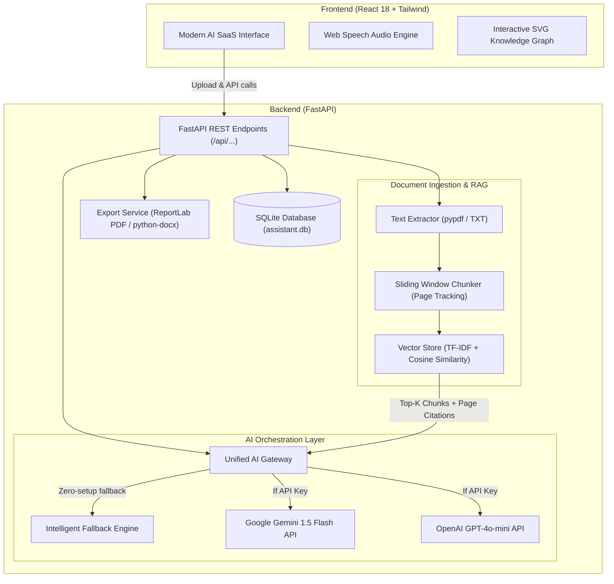

# AI Document Intelligence & Learning Assistant

> **"Don't just summarize a document. Help the user understand the document in the way they need."**

A modern, production-ready AI-powered document intelligence and adaptive learning platform. It transforms standard documents (PDFs, TXT, research papers, reports, study guides) into multi-dimensional learning experiences tailored specifically to the user's expertise level, learning purpose, format requirements, and target language.

---

## 🌟 Core Highlights & Capabilities

- 📊 **Main Dashboard**: High-level metrics (indexed documents, summaries created, questions asked, average quiz retention score), quick action cards, and recent learning activities.
- 📁 **Document Processing & Vectorization**: Upload PDFs (PyMuPDF / pypdf), TXT files, or paste raw text. The pipeline handles page detection, cleaning, sliding-window chunking with token overlap, and instant vector indexing.
- 📝 **Adaptive Summarization**:
  - **Word Counts**: 50, 100, 200, 500, or custom word targets.
  - **Output Formats**: Paragraph, Bullet points, Key takeaways, Executive summary.
  - **Time-Based Depths**: 30 seconds (elevator pitch), 2 minutes (executive brief), 5 minutes (comprehensive), 10 minutes (deep dive).
  - **Personalization Matrix**: 5 User Levels (*Beginner, Student, Researcher, Professional, Expert*) and 6 Objectives (*Quick Understanding, Exam Prep, Research, Presentation, Business, General Knowledge*).
- 💡 **"Explain This" Conceptual Deep Dive**: Plain-English breakdown of complex terms, equations, and mechanisms, complete with real-world analogies, why it matters, and difficult term breakdowns.
- 🔄 **Context-Preserving Paraphraser**: Rephrase sentences or sections across 5 distinct tonal registers (*Simple, Professional, Academic, Formal, Casual*) and length controls (*Shorter, Same length, More detailed*) with 0% semantic drift.
- 🌐 **Structural Translation**: Translate full documents, individual pages, or custom text into **English, Tamil, Tanglish (Tamil in Latin script), Hindi**, Spanish, French, or German while preserving formatting and headings.
- 💬 **Document-Grounded RAG Chat**: Interactive conversational interface with strict grounding:
  - Every answer provides clickable source citations with exact page numbers and verbatim excerpts.
  - If a requested fact is missing from the document, it strictly responds: *"The requested information was not found in the uploaded document."* No hallucinations.
- 🎓 **Study Mode & Interactive MCQ Quiz**:
  - Must-remember points and core definitions.
  - 2-mark, 5-mark, and 10-mark sample exam questions with hints.
  - Interactive MCQ Quiz with instant grading, answer reveal, confetti celebration, and automated weak-topic diagnosis.
- 🔬 **Research Paper Deconstruction**: Structured academic cards extracting *Title, Authors, Abstract, Research Problem, Methodology, Dataset & Benchmarks, Results, Limitations, and Future Work*.
- ⚖️ **Multi-Document Comparison**: Cross-compare 2 or more documents simultaneously across methodology, empirical findings, datasets, limitations, similarities, differences, and unique takeaways.
- 🕸️ **Visual Concept Knowledge Graph**: Interactive SVG node-link graph mapping root themes, components, datasets, and mechanisms with zoom, pan, and a concept inspector drawer.
- 🔊 **Audio Summary Reader**: Native text-to-speech engine supporting Play, Pause, Stop, and speed adjustments (*0.75x, 1.0x, 1.25x, 1.5x*).
- 💾 **Multi-Format Export**: Download generated summaries, translations, and paper analyses as **PDF** (via ReportLab), **DOCX** (via python-docx), **Markdown**, or plain **TXT**, plus one-click copy to clipboard.
- 🚀 **Intelligent Zero-Setup Demo Mode**: Operates 100% out of the box with 3 pre-seeded sample documents (*Transformer Architecture paper, Enterprise AI Strategy report, Biology exam guide*) even if no external API key is configured. Seamlessly switches to Google Gemini or OpenAI when a key is provided.

---

## 🏗️ Architecture & RAG Pipeline



---

## 🛠️ Tech Stack

- **Frontend**: React 18, Vite, Tailwind CSS v4, Lucide React icons, Axios, Canvas Confetti.
- **Backend**: Python 3.12, FastAPI, Uvicorn, Pydantic v2.
- **Document Processing**: `pypdf`, `python-docx`, `reportlab`.
- **RAG & Vector Retrieval**: In-memory & SQLite-backed Vector Store with TF-IDF, N-gram lexical boosting, and Cosine Similarity.
- **Database**: SQLite with Write-Ahead Logging (`PRAGMA journal_mode=WAL`).
- **AI Integration**: Google Gemini API, OpenAI API, and local heuristic Demo Engine.

---

## 📂 Project Structure

```
ai-document-assistant/
├── backend/
│   ├── app.py                     # FastAPI application entrypoint & static mount
│   ├── requirements.txt           # Python package requirements
│   ├── core/
│   │   └── config.py              # Settings, provider switching & env loader
│   ├── database/
│   │   └── database.py            # SQLite connection, schemas & tables
│   ├── rag/
│   │   ├── extractor.py           # Text extraction with page boundary tracking
│   │   ├── chunker.py             # Sliding-window chunker with page metadata
│   │   └── vector_store.py        # Vector Store with cosine similarity & lazy load
│   ├── ai/
│   │   ├── llm_service.py         # Unified AI service (Gemini / OpenAI / Demo)
│   │   └── demo_service.py        # Document-grounded intelligent local engine
│   ├── services/
│   │   ├── sample_docs.py         # Seeds sample papers, business & study docs
│   │   └── export_service.py      # PDF, DOCX, MD, and TXT exporter
│   ├── schemas/
│   │   └── models.py              # Pydantic request and response schemas
│   └── api/
│       ├── routes_documents.py    # Document upload, inspect & delete
│       ├── routes_summary.py      # Standard, personalized & time-based summaries
│       ├── routes_explain.py      # Conceptual breakdown ("Explain This")
│       ├── routes_paraphrase.py   # Multi-tone paraphraser
│       ├── routes_translate.py    # Multi-language translator
│       ├── routes_chat.py         # RAG Chat with page citations
│       ├── routes_study.py        # Exam notes, questions & MCQ quiz grading
│       ├── routes_research.py     # Academic paper structured analysis
│       ├── routes_compare.py      # Document comparison matrix
│       ├── routes_concept_map.py  # Knowledge graph data
│       ├── routes_export.py       # Downloadable exports
│       ├── routes_settings.py     # API key configuration & status
│       └── routes_history.py      # Persistent audit log & dashboard stats
├── frontend/
│   ├── package.json
│   ├── vite.config.js             # Vite config with Tailwind v4 & backend proxy
│   └── src/
│       ├── App.jsx                # Main application coordinator & dark mode
│       ├── index.css              # Tailwind styling & animations
│       ├── services/
│       │   └── api.js             # Frontend API client
│       ├── components/
│       │   ├── layout/
│       │   │   ├── Header.jsx     # Document switcher, language, theme toggle
│       │   │   └── Sidebar.jsx    # SaaS navigation
│       │   └── common/
│       │       └── AudioPlayer.jsx# Web Speech TTS player
│       └── pages/
│           ├── DashboardPage.jsx  # Metrics, hero & quick action workflows
│           ├── DocumentsPage.jsx  # Drag-and-drop uploader & chunk inspector
│           ├── SummarizePage.jsx  # Adaptive summary generator
│           ├── ExplainPage.jsx    # "Explain This" concept explorer
│           ├── ParaphrasePage.jsx # Multi-tone rewriter
│           ├── TranslatePage.jsx  # Language translation (Tamil, Tanglish, Hindi)
│           ├── ChatPage.jsx       # Grounded RAG Chat with citations
│           ├── StudyPage.jsx      # Notes, exam questions & interactive quiz
│           ├── ResearchPage.jsx   # Research paper cards
│           ├── ComparePage.jsx    # Document comparative matrix
│           ├── ConceptMapPage.jsx # Interactive visual knowledge graph
│           ├── HistoryPage.jsx    # Activity history & search
│           └── SettingsPage.jsx   # Provider & API key configuration
├── tests/
│   └── test_api.py                # Automated end-to-end test suite (13 tests)
├── .env.example
├── .gitignore
├── start_app.bat                  # One-click Windows runner
└── README.md
```

---

## 🚀 Quick Start Guide

### Prerequisites
- **Python 3.10+** (tested on Python 3.12)
- **Node.js 18+** and **npm**

### Step 1: Install Python Dependencies
```bash
cd backend
python -m pip install -r requirements.txt
```

### Step 2: Install Frontend Dependencies & Build
```bash
cd ../frontend
npm install
npm run build
```

### Step 3: Run the Unified Application
Run the backend with Uvicorn. Because the frontend build is automatically mounted, accessing `http://localhost:8000` serves the complete React SPA:
```bash
cd ../backend
python -m uvicorn app:app --host 127.0.0.1 --port 8000 --reload
```
Open your browser and navigate to:
👉 **`http://localhost:8000`**

*(Alternatively, you can run `npm run dev` inside `frontend/` to run Vite in hot-reloading development mode on `http://localhost:5173`.)*

---

## 🔑 AI API Key Configuration (Optional)

The application functions completely out of the box in **Intelligent Demo Mode**. 

To connect live generative LLMs:
1. Navigate to the **Settings** tab in the web UI (or create a `.env` file in the project root based on `.env.example`).
2. Add your **Google Gemini API Key** or **OpenAI API Key**:
   ```env
   GEMINI_API_KEY=your_gemini_api_key_here
   OPENAI_API_KEY=your_openai_api_key_here
   LLM_PROVIDER=gemini
   ```
3. Save settings. The system instantly switches to live generation without requiring a server restart.

---

## 🧪 Running Automated Tests

The platform includes a test suite covering health, extraction, summarization, explanation, paraphrasing, translation, RAG citations, "not found" guardrails, quiz scoring, research paper decomposition, and document comparison:

```bash
cd ai-document-assistant
python -m unittest tests/test_api.py
```

---

## 🚀 Deploying to Render (Web Service)

This repository is pre-configured for 1-click or repository deployment on [Render](https://render.com/).

### Option A: Using `render.yaml` Blueprint
1. In your Render Dashboard, click **New +** > **Blueprint**.
2. Connect your Git repository.
3. Render automatically reads `render.yaml`, configures the build and start commands, and provisions the web service.

### Option B: Manual Web Service Setup
1. In Render, select **New +** > **Web Service**.
2. Connect your repository.
3. Configure the following settings:
   - **Environment**: `Python 3`
   - **Build Command**: `./build.sh` (or `cd frontend && npm install && npm run build && cd ../backend && pip install -r requirements.txt`)
   - **Start Command**: `cd backend && uvicorn app:app --host 0.0.0.0 --port $PORT`
4. Add Environment Variables (optional, for live AI providers):
   - `GEMINI_API_KEY`: *(Your Google Gemini API Key)*
   - `OPENAI_API_KEY`: *(Your OpenAI API Key)*
   - `LLM_PROVIDER`: `demo` (or `gemini` / `openai`)
   - `FORCE_DEMO_MODE`: `false`
5. Click **Deploy Web Service**. Render will build the React bundle, install the backend dependencies, and serve the unified production application on your assigned `https://<service-name>.onrender.com` URL.

---

## 🛡️ Security & Privacy Principles

- API keys are handled strictly via environment variables or backend memory; they are **never** rendered or transmitted to client-side scripts.
- Uploaded files are validated against allowed extensions (`.pdf`, `.txt`, `.md`) and size caps.
- RAG searches run within document-isolated vector spaces, preventing cross-tenant document bleeding.
- `.env` and SQLite database files are excluded from Git commits via `.gitignore`.
